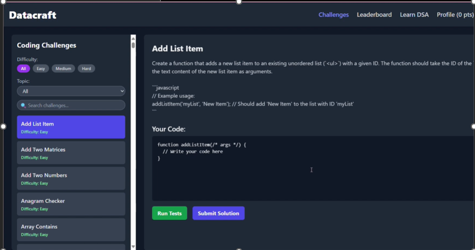
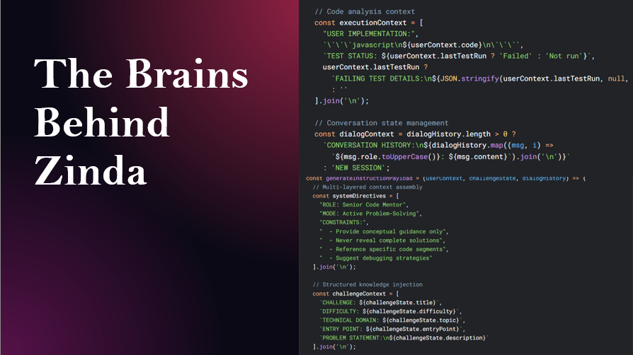

# 📊 Data Craft

An open-source, gamified platform to support **data science education** at Alexandria University. Built with modern technologies like **React**, **Firebase**, and AI integrations, Data Craft empowers students to practice, learn, and grow in a fun and interactive environment.

---

## 🎓 Project Summary

> "Designed by students, for students."

**Data Craft** is more than just a coding platform—it's a complete learning ecosystem that:
- Provides interactive quizzes and exercises.
- Uses **AI assistance** for smart feedback.
- Enables **code execution** directly in the browser.
- Delivers detailed performance analytics.
- Encourages collaboration through leaderboards and multiplayer challenges.

---

## 🧠 Key Features

### 💡 Gamified Learning Experience
- Interactive exercises and real-time feedback
- Points, badges, and rewards system (planned)

### 🤖 AI Assistant
- Natural language chatbot powered by Hugging Face API
- Helps students debug, understand, and get hints

### 🧪 Code Submission Platform
- Users write and execute code in-browser
- Secure sandbox environment

### 📈 Personalized Analytics
- Tracks engagement, challenge success rate, and confidence levels
- Visualizes data trends using charts and dashboards

---

## 🔧 Tech Stack

| Layer        | Technology             |
|--------------|-------------------------|
| Frontend     | React.js, Tailwind CSS  |
| Backend      | Firebase (Auth, Firestore, Storage) |
| AI Bot       | Hugging Face API        |
| Deployment   | [Planned] Heroku / AWS  |

---

## 🧩 System Architecture

) <!-- 
-->

---

## 📊 User Behavior Analysis

Over a controlled testing period (March–May 2025), 53 users interacted with the platform. Their behavior was analyzed to improve usability.

 <!-- Replace with actual image -->

Key metrics tracked:
- Page visit timestamps
- Session duration
- Drop-off points in challenge funnel
- Cursor heatmap (focus areas)
- Time to first hint
- Performance across topics & difficulty

---

## 📋 Survey Insights

👥 **857 respondents** participated in our surveys.

- **Most preferred learning style:** Online/Hybrid  
- **Top programming languages:** Python & SQL  
- **Biggest challenges:** Lack of interactivity, motivation, and AI guidance

 <!-- Replace with actual image -->
 <!-- Replace with actual image -->

---

## 🧪 Core App Components

### 🔐 User Authentication

- Firebase Auth with secure session handling

 <!-- Replace with actual image -->

---

### 🏠 Home Page

- Submit code via text editor
- Get evaluated and receive immediate feedback

 <!-- Replace with actual image -->

---

### 📚 Exercise Page

- Instant results (Correct / Incorrect)
- Tracks progress and stores submissions

 <!-- Replace with actual image -->
 <!-- Replace with actual image -->

---

### 🧠 AI Chatbot

- Ask coding questions or get hints
- Available 24/7

 <!-- Replace with actual image -->

---

## 🚀 Future Work

| Feature                  | Description |
|--------------------------|-------------|
| 🎥 Video Tutorials       | Step-by-step visual guides |
| 🧠 Expanded Problem Library | Advanced problems in data science & algorithms |
| 📊 Analytics Dashboard   | Personalized performance tracking |
| 📘 Verified Courses & Articles | From industry experts with certification |
| ☁️ Cloud Deployment      | Shift to Heroku or AWS |
| 👥 Multiplayer Challenges | Team-based coding competitions |
| 👨‍🏫 Educator Access      | Teachers can add & manage content |

---

## 👨‍👩‍👧‍👦 Team

> Under the supervision of **Prof. Bothaina Al Sobky**

### 🎓 Contributors
- [Add Team Member Names Here]

---

## 📩 Contact & Feedback

If you’re a student, educator, or contributor—**we’d love your input**!

Submit issues, feature requests, or questions via the [Issues tab](https://github.com/your-repo/issues) or reach out by email.

---

## 📄 License

This project is licensed under the [MIT License](LICENSE).

---

